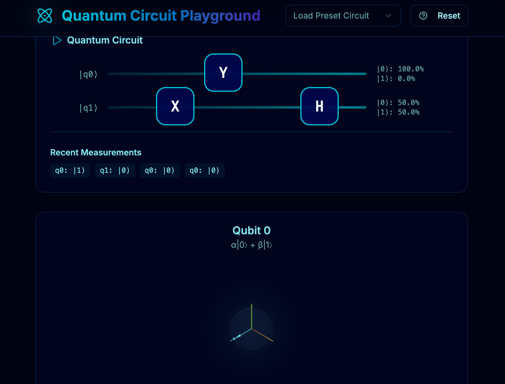

# Quantum Circuit Play

Quantum Circuit Play is an interactive web application designed to make quantum computing concepts engaging and accessible. Built with **React** and **TypeScript**, this app allows users to explore the foundations of quantum circuits through  drag-and-drop mechanics, 3D Bloch sphere representations, and real-time quantum state calculations.

## Preview

[Try it out.](https://gh.io/q-playground)



## Features

- **Drag-and-Drop Quantum Circuit Builder**  
  Easily create, modify, and experiment with quantum circuits using a user-friendly interface.

- **3D Bloch Sphere Visualization**  
  Observe quantum states as dynamic, animated 3D Bloch spheres, making abstract concepts tangible.

- **Real-Time Quantum State Calculations**  
  Instantly see the effects of your circuit changes with live quantum state updates and visual feedback.

## Getting Started

### Prerequisites

- Node.js (v16 or higher recommended)
- npm or yarn

### Installation

```bash
git clone https://github.com/dvelton/quantum-circuit-play.git
cd quantum-circuit-play
npm install
```

### Running the Application

```bash
npm start
```

The app will launch in your browser at [http://localhost:3000](http://localhost:3000).

## Technologies Used

- **React** & **TypeScript**
- **Three.js** (for 3D visualization)
- **Styled Components** (for futuristic UI)
- **Quantum Computing Libraries** (for state calculations)

## Contributing

Contributions, feedback, and new ideas are welcome!  
Feel free to open issues or submit pull requests to help improve Quantum Circuit Playground.

---

**Quantum Circuit Play**: Making quantum computing visual, interactive, and fun.
